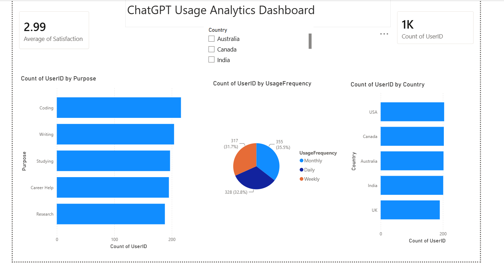

**ChatGPT Usage Analytics Dashboard**

**Overview**

This project analyzes ChatGPT user behavior using Python and Power BI.

&#x20;**Tools Used**

\- Python

\- Pandas

\- Matplotlib

\- Power BI

&#x20;**Key Insights**

\- Coding is the most common use case.

\- User activity is distributed across daily, weekly, and monthly usage.

\- Average satisfaction score is 2.99.

\- Interactive dashboard allows filtering by country.

**Dashboard Features**

\- Total Users KPI

\- Average Satisfaction KPI

\- Purpose Analysis

\- Usage Frequency Analysis

\- Country Analysis

\- Interactive Slicer

## Dashboard Preview

